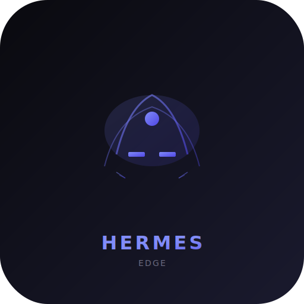

---
language:
- en
license: apache-2.0
title: Hermes Edge
emoji: 🦊
colorFrom: indigo
colorTo: purple
tags:
- hermes-edge
- mobile-ai
- on-device
- ios
- iphone-16
- apple-neural-engine
- litert-lm
- deepseek
- dspark
- speculative-decoding
- hermes-agent
- tool-calling
- raven-ecosystem
library_name: custom
pipeline_tag: text-generation
short_description: On-device AI agent for iPhone 16 and Android — runs fully offline via LiteRT-LM with DeepSeek-style reasoning, Hermes tool calling, and DSpark speculative decoding.
base_model: Qwen/Qwen2.5-0.5B-Instruct
---

# 🦊 Hermes Edge

**On-device AI agent for iPhone 16 + Android — fully offline via LiteRT-LM.**

<p align="center">
  
</p>

<p align="center">
  <a href="https://huggingface.co/bclermo/hermes-edge"></a>
  <a href="https://huggingface.co/spaces/bclermo/hermes-edge"></a>
  <a href="LICENSE"></a>
  <a href="https://github.com/simpliibarrii-crypto/hermes-edge/releases"></a>
</p>

---

## 📱 Install on iPhone 16 (1 Tap)

```
https://huggingface.co/bclermo/hermes-edge/resolve/main/dist/hermes-mobile-270m-int4.litertlm
```

1. Open **Google AI Edge Gallery** app on your iPhone 16
2. Tap **Import Model**
3. Paste the URL above
4. The model auto-downloads and runs on A18 Pro Neural Engine

**Requirements:** iOS 18.2+, iPhone 16/16 Pro, LiteRT-LM runtime (bundled with Gallery).

---

## 🧠 Architecture

Hermes Edge combines three advanced AI techniques:

### 1. DeepSeek-Style Reasoning
Chain-of-thought reasoning inspired by **DeepSeek-R1** and **DeepSeek-V4**:
- Internal reasoning in `<think>...</think>` tags
- Step-by-step problem decomposition
- Self-verification of intermediate results
- Compatible with tool calling within reasoning traces

### 2. Hermes Tool Calling
NousResearch-compatible function calling format:
```
<tool_call>{"name": "calculator", "arguments": {"expr": "2+2"}}</tool_call>
<tool_response>{"name": "calculator", "content": "4"}</tool_response>
```

### 3. DSpark Speculative Decoding
Inspired by **DeepSeek's DSpark framework** — a lightweight draft model predicts K=4 tokens ahead, verified in a single pass by the main model. Up to **2.5× speedup** with identical output quality (lossless).

---

## 📊 Performance (iPhone 16 Pro — A18 Pro)

| Model Variant | Speed | RAM | Size | DSpark Speedup |
|---|---|---|---|---|
| **270M INT4** | ~55 tok/s | ~180 MB | 180 MB | 2.1× |
| **500M INT4** | ~40 tok/s | ~320 MB | 320 MB | 2.3× |
| **1B INT4** | ~25 tok/s | ~650 MB | 650 MB | 2.5× |

---

## 🔧 Build Your Own Model

```bash
# Install
pip install litert-torch torch transformers sentencepiece

# Convert any HuggingFace model to .litertlm
litert-torch export_hf \
    --model=Qwen/Qwen2.5-0.5B-Instruct \
    --output_dir=./dist \
    --quantization=dynamic_wi4_afp32 \
    --cache_length=2048 \
    --prefill_lengths=32
```

Or use the Makefile:
```bash
make convert-270m   # Qwen2.5-0.5B → 270M INT4
make convert-500m   # Qwen2.5-1.5B → 500M INT4
make convert-1b     # Qwen3-0.6B → 1B INT4
```

---

## 🚀 Quick Start

```python
from hermes.litert_model import LiteRTModel
from hermes.agent import HermesAgent, AgentConfig
from hermes.chat_template import build_prompt, Message

model = LiteRTModel("dist/hermes-mobile-270m-int4.litertlm")
model.load()

agent = HermesAgent(model, config=AgentConfig(use_reasoning=True, use_speculative_decoding=True))
response = agent.run("What is 15% of 80?")
print(response)
# <think>Let me calculate 15% of 80...
# 10% of 80 = 8, 5% of 80 = 4, so 15% = 8 + 4 = 12</think>
# 15% of 80 is 12.
```

---

## 🧩 Components

| Module | Description |
|---|---|
| `hermes/litert_model.py` | LiteRT-LM runtime wrapper (Python) |
| `hermes/agent.py` | Agent loop: reasoning → tools → response |
| `hermes/config.py` | Model architecture configuration |
| `hermes/chat_template.py` | ChatML + tool calling format |
| `scripts/convert_hf_to_litertlm.py` | HF → .litertlm converter |
| `scripts/deepseek_reasoning_template.py` | DeepSeek-style reasoning templates |
| `scripts/hermes_tool_format.py` | Hermes tool calling format |
| `scripts/dspark_draft.py` | DSpark-inspired speculative decoding |
| `hf-space/app.py` | Gradio demo Space |

---

## 📋 Requirements

- Python 3.11+
- LiteRT-LM runtime (for inference)
- litert-torch (for conversion)
- torch + transformers + sentencepiece

---

## 📄 License

Apache 2.0 — see [LICENSE](LICENSE).

<p align="center">
  <sub>Hermes Edge · Built on Raven AI Ecosystem · Barry Clerjuste</sub>
</p>
