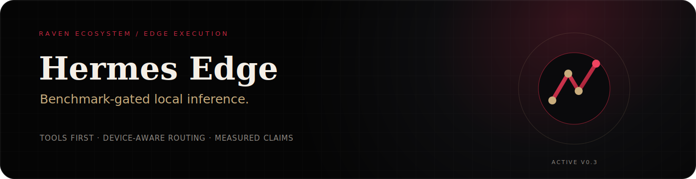
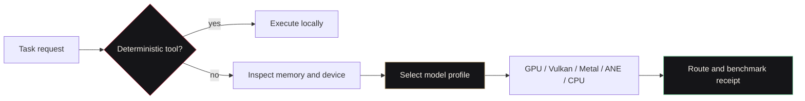

---
language:
- en
license: apache-2.0
title: Hermes Edge
emoji: ⚡
colorFrom: gray
colorTo: red
tags:
- hermes-edge
- mobile-ai
- on-device
- android
- ios
- gpu-first
- litert-lm
- gemma
- tool-calling
- local-first
library_name: custom
pipeline_tag: text-generation
short_description: Benchmark-gated local AI routing for phones, laptops, tablets, and edge boxes.
base_model: google/gemma-3n-E2B-it
---

<p align="center">
  
</p>

<p align="center">
  <a href="https://simpliibarrii-crypto.github.io/project.html?project=hermes-edge"></a>
  <a href="https://huggingface.co/bclermo/hermes-edge"></a>
  <a href="LICENSE"></a>
</p>

> **Hermes Edge** is the device-aware execution layer in the Raven ecosystem. It routes deterministic tools before model calls, then selects a local model profile and backend according to available memory, runtime support, and benchmark evidence.

**Maturity:** Active v0.3 research and development project. Device coverage is still expanding. No universal-hardware or production-readiness claim is made.

## What it proves

- Tool-first routing can avoid unnecessary inference.
- Device memory and runtime availability can shape model selection explicitly.
- LiteRT-LM, GPU, Vulkan, Metal, ANE, AICore, and CPU paths can be described as ordered policies rather than magical acceleration.
- Public performance claims can require reproducible benchmark metadata.
- Route and fallback decisions can produce portable audit records for Home for AI and Raven.

## Routing model



## Fast install

```bash
git clone https://github.com/simpliibarrii-crypto/hermes-edge.git
cd hermes-edge
python3 -m venv .venv
source .venv/bin/activate
pip install -e ".[dev]"
pytest tests/test_edge_policy.py tests/test_agent_edge_routing.py tests/test_litert_backend.py -q
```

Install the local model runtime only where needed:

```bash
pip install -e ".[runtime]"
hermes --model dist/hermes-mobile-270m-int4.litertlm --backend auto
```

`--backend auto` is GPU-primary. Hermes tries supported accelerated delegates and preserves a CPU fallback where available.

Additional extras:

```bash
pip install -e ".[model,conversion,runtime]"  # model and conversion tools
pip install -e ".[space,model]"               # Hugging Face demo
pip install -e ".[all]"                       # complete development stack
```

## Device paths

| Device | Recommended path | Backend priority |
|---|---|---|
| Android | LiteRT-LM or compatible AI Edge import | GPU, Vulkan, AICore where exposed, CPU fallback |
| iPhone / iPad | Compatible local bundle where available | GPU, Metal, ANE, CPU fallback |
| macOS | Python package plus supported local runtime | GPU or Metal first, CPU fallback |
| Linux edge box | Python package plus supported local runtime | GPU or Vulkan first, CPU fallback |
| Windows | Routing and development package; runtime where supported | GPU first, CPU fallback |

## Benchmark contract

A public result should include:

- exact device and operating system
- model profile and quantization
- backend or delegate
- time to first token
- prefill and decode rate
- peak memory
- thermal state
- fallback behaviour

See [`docs/BENCHMARK_CONTRACT.md`](docs/BENCHMARK_CONTRACT.md).

## Ecosystem role

| System | Hermes relationship |
|---|---|
| [Home for AI](https://github.com/simpliibarrii-crypto/home-for-ai) | Displays route choices, runtime state, model profiles, and fallback traces |
| [Raven AI](https://github.com/simpliibarrii-crypto/raven-ai) | Receives evidence-linked route metadata and scientific workflow execution |
| [OpenClinical AI](https://github.com/simpliibarrii-crypto/openclinical-ai) | Provides bounded local execution for suitable consent-aware tasks |
| [Raven BioComputer](https://github.com/simpliibarrii-crypto/simpliibarrii-crypto-raven-biocomputer) | Routes deterministic biology tools before larger models or remote calls |
| JSpace Chain | Adds observable policy, risk, and reflection snapshots to route decisions |

## Contributing

Start with the **[reproducible edge benchmark matrix](https://github.com/simpliibarrii-crypto/hermes-edge/issues/26)**. Contributions should identify their exact hardware and avoid generalizing one result to other devices.

## Public proof

- [Branded project page](https://simpliibarrii-crypto.github.io/project.html?project=hermes-edge)
- [Complete portfolio](https://simpliibarrii-crypto.github.io/)
- [Research archive](https://simpliibarrii-crypto.github.io/research.html)

## License

Apache-2.0. See [LICENSE](LICENSE).
